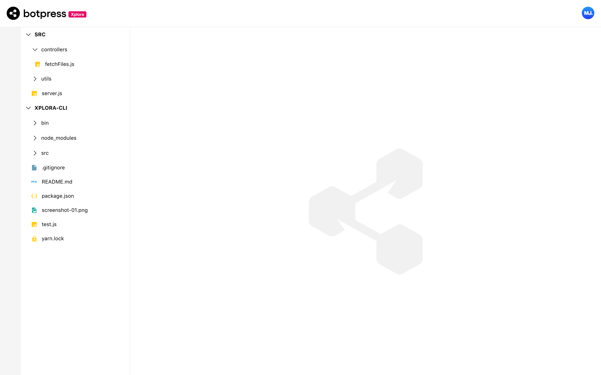

> **Note** This project was created over a weekend and serves solely as a learning tool. Nothing more

# Xplora 🍄

A CLI tool to visualize directories on your file system right in your browser, it also watches for changes in specified directories.



## Installation

To test the project easily, I've published it to npm. **Feel free to skip this section if you'll like to do all the setup on your machine.**

### Install Globally

```
npm i -g xplora-cli
```

### Test without permanent global installation(npx)

```
npx xplora-cli [LIST OF DIRECTORIES]
```

[See Usage](#usage)

## Usage

```
$ xplora-cli DIRECTORIES | [LIST OF DIRECTORIES]
```

### Examples

<br/>

Opens `~/Desktop` with xplora

```
$ xplora-cli ~/Desktop
```

Opens current directory with xplora

```
$ xplora-cli .
```

Opens `thisDirectory` and `anotherDirectory` with xplora

```
$ xplora-cli thisDirectory anotherDirectory
```

## Clone and Run Locally

This repo is a monorepo with two packages

1.  The CLI (`packages/xplora-cli`)
2.  The Frontend (`packages/frontend`)

### Install dependecies

This uses [yarn workspaces](https://classic.yarnpkg.com/lang/en/docs/workspaces/) to intall dependecies for each package in their [respective directories](https://classic.yarnpkg.com/blog/2018/02/15/nohoist/)

```
yarn
```

### Run test

```
 yarn test
```

### Build a distributable version

```
yarn build
```

### Testing `xplora-cli` lacally

```
cd dist
```

```
yarn link
```

```
$ xplora-cli DIRECTORY | [LIST OF DIRECTORIES]
```

[See Usage](#usage)

### Development

```
yarn develop
```

This spins up:

1. A Frontend dev server with react scripts. It makes an API to server to fetch files
2. A nodejs server listening on 3001. It broadcasts a `CHANGE` event with socket.io when changes occur

## TODO

- [ ] Write more test cases
- [ ] Front end Theming
- [ ] Make frontend more accessible
- [ ] Add Typescript to CLI code
- [ ] Make CLI more interactive
